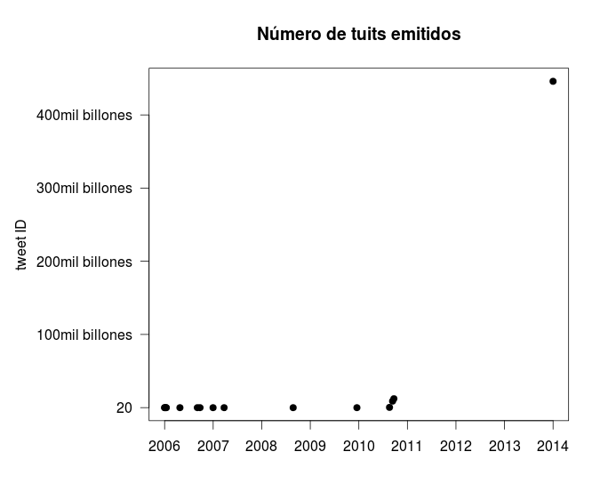
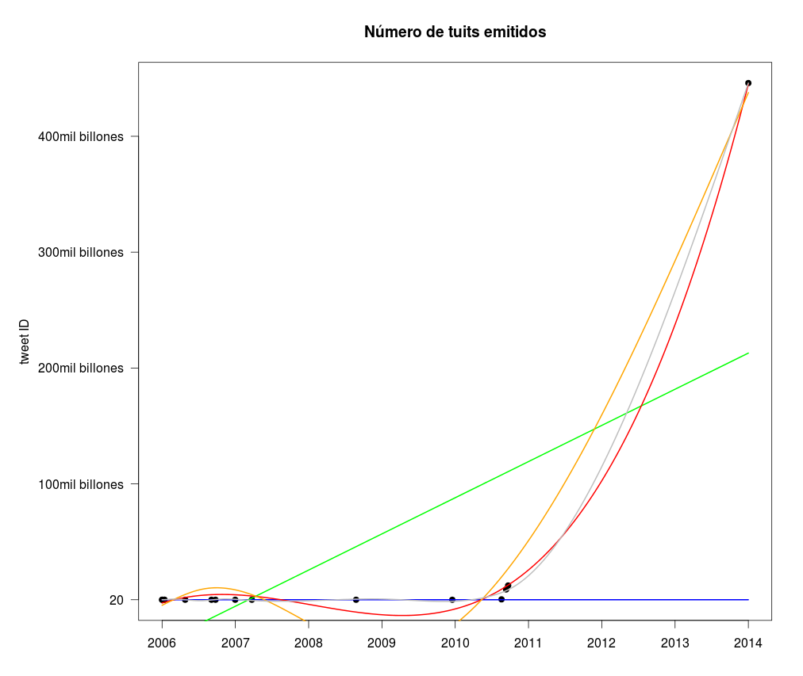
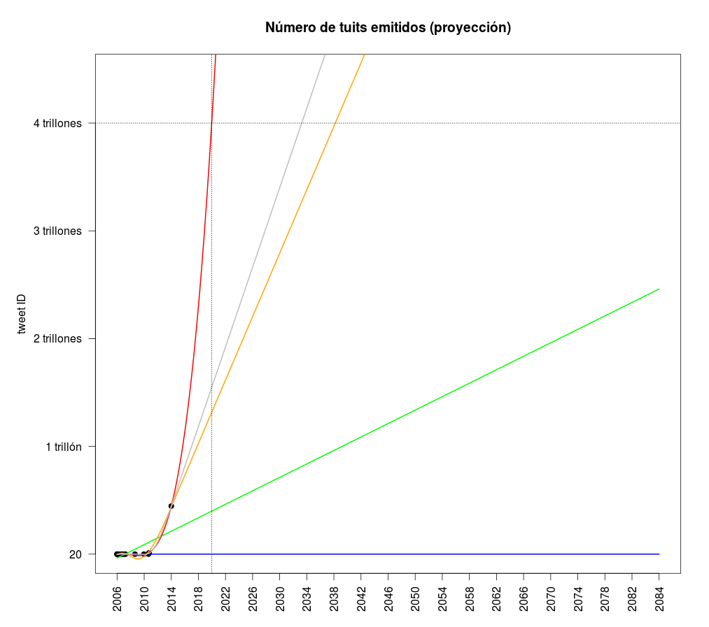

# Identificadores de usuarios, posts, tuits, etc
Ya sabemos que las redes sociales son en realidad bases de datos que organizan
datos categorizados como objetos (vídeos, fotos, posts, tuits, etc).
Para que estos objetos puedan ser encontrados rápidamente para y ser mostrados
al usuario cuando lo requiera, es necesario que tengan un identificador único
(**id**).

Las redes sociales usan diversos tipos de ids públicos para identificar sus
productos. 
Por ejemplo Youtube usa una serie extraña de caracteres como id público de sus vídeos.
Este vídeo que encontré al azar tiene el identificador
**[846cqfUuQZA](https://www.youtube.com/watch?v=846cqfUuQZA)**:

](img1.png)

# Identificadores de Twitter
Los ids de Twitter son más simples. Son una serie de números que van aumentando uno a uno conforme se
vayan creando nuevos tuits. 

Por ejemplo el [primer tuit de nuestro presidente](https://discover.twitter.com/first-tuit#Ollanta_HumalaT) tiene el id
15295318521. O sea quince mil doscientos noventa y cinco millones trescientos
dieciocho mil quinientos veintiuno.

    https://twitter.com/Ollanta_HumalaT/statuses/15295318521

](img2.png)

El primer tuit de la historia debería tener como id el número **uno** (o el número
**cero** si eres computadora y no humano).
Pero en realidad el primer tuit (reliquia histórica) pertenece a un [co-fundador
de
Twitter](http://finance.yahoo.com/news/the-first-ever-email--the-first-tuit--and-12-other-famous-internet-firsts-181209886.html)
y tiene el id **20**. Este es:

https://twitter.com/jack/status/20

# Ventajas de usar números como ids
Cuando los programadores quieren acceder a tuits en grandes cantidades tienen
que usar la interfaz diseñada por Twitter para estos propósitos (la conocida
[API versión 1.1](https://dev.twitter.com/docs/api/1.1)).
Esta interfaz es la que usan los tuiter bots y varias aplicaciones que analizan
twitter con fines de marketing, investigación científica, etc.

El funcionamiento del API de twitter depende críticamente del hecho que sus ids
sean números. Por ejemplo cuando un bot hace búsquedas de tuits que usan un
determinado *#hashtag* puedes restringir los pedidos a twitter para que solo
te dé los tuits recientes, y que no te devuelta tuits repetidos que ya hayas
descargado en una búsqueda anterior.
Esto se logra pasando el parámetro **since_id** conteniendo el número de id de
algún tuit en particular (digamos 10000000, id número diez millones). Entonces
el API de tuiter te devolverá tuits que tengan id mayores a diez millones y tu
tendrás confianza que son tuits más recientes al tuit indicado.

Ya que no se puede descargar del API de tuiter muchos miles de tuits de un solo
cochacho, puedes ir descargándolos en grupos, y usar el parámetro **since_id**
como límite inferior del siguiente grupo de tuits a descargar.

# Posibles inconvenientes 
## Al menos inconveniente en cuestiones estéticas
Conforme aumente la cantidad
de tuits generado por los usuarios, la longitud de los ids aumentará
rápidamente y posiblemente llegue a copar buena parte de la barra de URL de tu navegador.

En cuestión de 8 años el número de dígitos de los ids de los tuits han
aumentado considerablemente:

> Año 2006: https://twitter.com/jack/status/20
> Año 2014: https://twitter.com/jack/status/447097841249288192

Me pareció interesante averiguar si el uso de id numérico es buena opción para
una base de datos tan grande como Twitter, que genera una gran cantidad de
objetos (tuits) debido a sus millones de usuarios (algunos prefieren usar otro
tipo de identificadores en lugar de ids numéricos).

Entonces me puse mi sombrero del mago Merlín para tratar de predecir en qué año habrán
tantos dígitos en el id de los tuits que estos llegarán a copar la barra de
URL de los navegadores de internet.

## Cosecha de tuits
Escribí un script en Python que trate de descargar la fecha del tuit número
cien, número mil, diez mil, cien mil, etc. En caso no existía el tuit, el
script debería buscar el siguiente más próximo.

      2006-03-21 00:00:00,20
      2006-03-22 00:00:00,100
      2006-04-02 00:00:00,1000
      2006-07-14 00:00:00,10000
      2006-11-22 00:00:00,100003
      2006-12-12 00:00:00,1000003
      2007-03-20 00:00:00,10000001
      2007-06-11 00:00:00,100000012
      2008-11-11 00:00:00,1000000000
      2010-03-05 00:00:00,10000000000

Los primeros diez mil millones de tuits fueron rápidos de encontrar. Verás que
no existe el tuit número 1 millón. El más cercano es el 1 millón tres y fue
generado el 12 de Diciembre del 2006. [Aquí lo puedes ver](https://twitter.com/giuseppe/status/1000003).
El tuit diez mil millones fue generado el 5 de Marzo del 2010 
([aquí está](https://twitter.com/WishingOnThat/status/10000000000)).

Por alguna razón fue difícil encontrar los tuits 100 mil millones y superiores.
Tuve que improvisar y pude encontrar algunos más en los cuales su id haya
aumentado en número de dígitos:

    2010-11-05 00:00:00,360933880766465
    2010-11-28 00:00:00,8906022500433920
    2010-12-08 00:00:00,12321271228407808
    2014-03-18 00:00:00,445966921494585345
   
Parece que el 2010 hubiera sido un año muy activo para los usuarios de Twitter.
El número de dígitos de los id creció bastante.

## Ploteando los tuits
Usando el paquete estadístico R, me puse a plotear el número de tuits id (o sea
el número de tuits emitidos) versus la línea del tiempo.
Este es el gráfico que salió.

Pero para poder predecir la velocidad de aumento de los tuits es necesario 
ajustar la línea a algún tipo de tendencia. Es decir, hay que modelar los
puntos observados en el gráfico y ver a qué modelo se ajustan mejor. 
Si bien estos modelos no tienen mucha fabulosidad, son algo interesantes.
En el siguiente gráfico se ven los puntos ajustados a los modelos lineal,
polinómico e [interpolación de *splines*](http://en.wikipedia.org/wiki/Spline_interpolation).

Los modelos sobre el gráfico se ven así:

Según el gráfico, se ajustan mejor a los datos las línea roja y gris
(polinómica y *spline*). Pero este gráfico solo muestra los tuits actuales.

Y si tratamos de predecir el comportamiento de tuits futuros? Podemos alargar
el gráfico para ver cuántos tuits se habrán emitido el año 2016, o el más
interesante año [2046](http://www.imdb.com/title/tt0212712/).
Al extrapolar el modelo hacia el futuro se obtiene este gráfico:

Vemos que la línea roja va mejor con los datos. Este modelo está basado en un
polinomio cúbico (o sea ecuación de [tercer grado](http://es.wikipedia.org/wiki/Ecuaci%C3%B3n_de_tercer_grado)).
En este gráfico se ve que probablemente se llegue al tuit número 1 trillón en
el año 2017. Pero más importante para mis intereses es encontrar que
posiblemente se llegue al tuit número 4 trillones en el año 2020.

Cuatro trillones es un número incomprensiblemente grande y seguramente la
barra del navegador de estará lleno de dígitos por culpa del id de tuits
futuros.
Si en el 2014 se han producido solo alrededor de 450 mil billones de tuits,
para el año 2020 tendremos más de 4 trillones de tuits!

O sea el id habrá crecido de la siguiente manera:

    > Año 2014 (19 dígitos) https://twitter.com/jack/status/447097841249288192
    > Año 2020 (20 dígitos) https://twitter.com/jack/status/4470978412492881920 

Si bien la cantidad de tuits será muchísimo mayor, el id sólo aumentará en un
dígito.

# TL;DR
Es poco probable que se pueda llenar la barra de los navegadores con los
dígitos de los ids de tuits.

Sorris por hacerte perder tu tiempo al leer este post.
